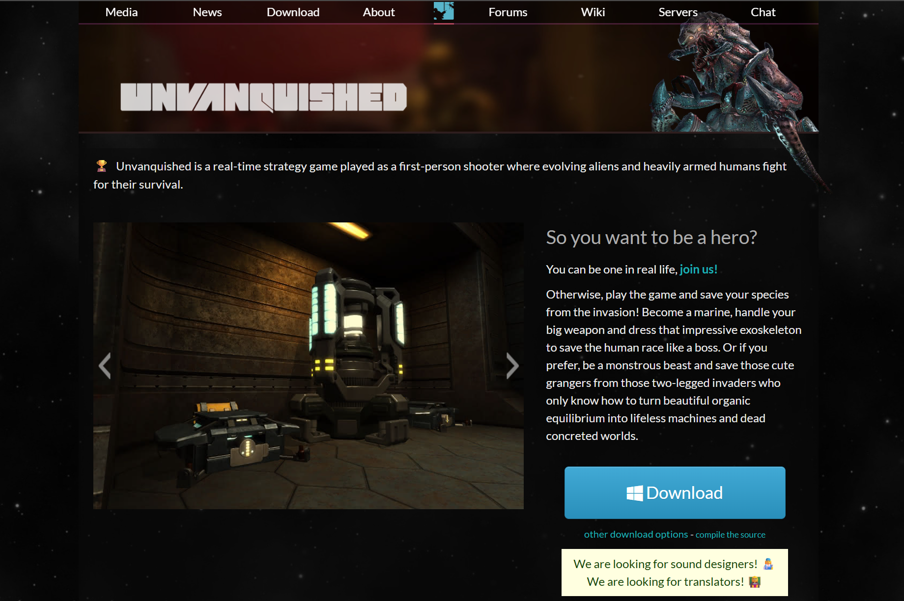
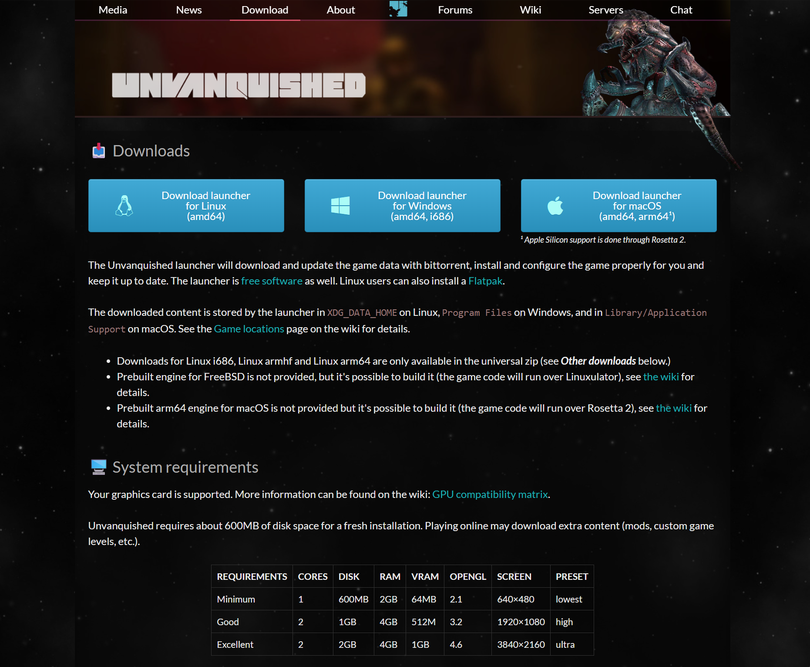
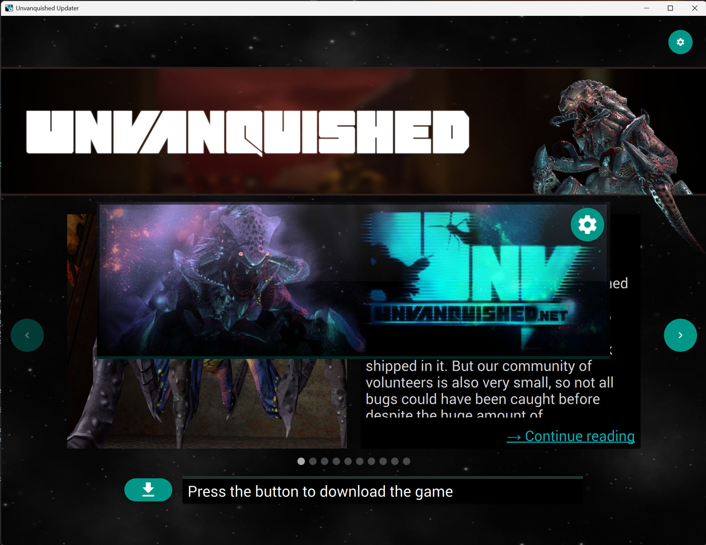
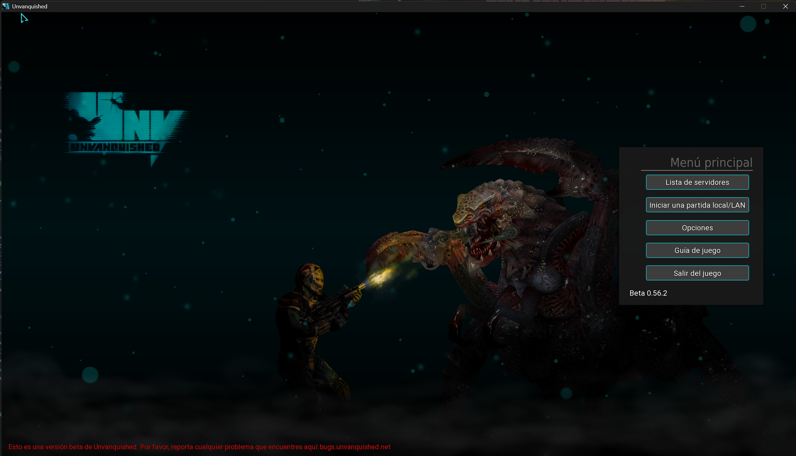

# Instalación de un juego open source multiplataforma

**Juego elegido:** Unvanquished  
**Actividad:** Instalación y documentación de un juego open source  
**Sistema usado:** Windows 11 / Windows NT 10.0.26200

## Parte 1. Búsqueda de información

Unvanquished es un videojuego gratuito y de código abierto que combina acción en primera persona con elementos de estrategia en tiempo real. En el juego se enfrentan dos bandos: humanos tecnológicamente avanzados y alienígenas adaptables. El objetivo principal es destruir la base enemiga mientras se construyen estructuras y se mejora el equipo o las habilidades.

| Dato | Información |
| --- | --- |
| Nombre del juego | Unvanquished |
| Tipo de juego | FPS/RTS híbrido. Es un shooter en primera persona con construcción de bases y estrategia en tiempo real. |
| Sistemas operativos compatibles | Windows, GNU/Linux y macOS. |
| Tipo de licencia | Código abierto. El repositorio incluye licencia GPL para el código del juego y del motor Daemon. Los recursos/artes pueden tener licencias específicas. |
| Página oficial | <https://unvanquished.net/> |
| Repositorio | <https://github.com/Unvanquished/Unvanquished> |
| Requisitos mínimos aproximados | Procesador de doble núcleo, 4 GB de RAM, tarjeta gráfica compatible con OpenGL, unos 2 GB de espacio libre y conexión a Internet para el modo multijugador. En Windows se recomienda una versión moderna de 64 bits. |

## Parte 2. Comprobaciones tras la instalación

| Comprobación | Resultado |
| --- | --- |
| ¿Se ha instalado correctamente? | Sí. La instalación finalizó y el juego quedó disponible para ejecutarse desde la carpeta descargada. |
| Origen de instalación | Desde navegador web, usando la página oficial de descarga de Unvanquished. También existen alternativas mediante Flatpak en Linux o descarga desde GitHub/SourceForge. |
| Permisos o confirmaciones solicitadas | Al descargar el juego apareció una advertencia indicando que había que asegurarse de que la descarga era segura porque no era una descarga conocida. No se detectó ningún tipo de malware. Para jugar en red local también fue necesario revisar el firewall de Windows. |
| Acceso directo o entrada en el menú | Con la descarga en formato ZIP no se crea automáticamente una entrada en el menú Inicio. El juego se ejecuta desde la carpeta descomprimida. Se puede crear manualmente un acceso directo a `daemon.exe` o al lanzador correspondiente. |
| ¿El juego se ejecuta correctamente? | Sí. El juego se abre, muestra el menú principal y permite acceder a las opciones de partida. |
| ¿Se ha probado en multijugador? | Sí. Se probó en red LAN usando la red Andared_Corporativo. El servidor no aparecía directamente en la lista de servidores LAN, por lo que otros jugadores tuvieron que entrar desde la consola con el comando `/connect IP`, usando mi IP de Andared_Corporativo. |

## Parte 3. Documentación del proceso

### 1. Datos del software

| Dato | Información |
| --- | --- |
| Nombre | Unvanquished |
| Licencia | Open source. Código bajo GPL, según el repositorio oficial. |
| Página oficial | <https://unvanquished.net/> |
| Sistema operativo usado | Windows 11 / Windows NT 10.0.26200 |

### 2. Proceso de instalación

1. Se abrió el navegador y se buscó el juego escribiendo **Unvanquished open source game**.
2. Se accedió a la página oficial <https://unvanquished.net/>.
3. Desde la sección **Download** se seleccionó la descarga para Windows.
4. Se descargó el instalador/lanzador del juego desde la página oficial.
5. Se descomprimió el contenido en una carpeta local.
6. Se ejecutó el juego y apareció la pantalla inicial para descargar los archivos necesarios.
7. Si Windows mostró advertencia de seguridad o de descarga desconocida, se revisó el origen del archivo y se continuó al comprobar que procedía de la página oficial.
8. Se comprobó que el menú principal carga correctamente.
9. Se creó una partida local y se probó la conexión en LAN. En la red Andared_Corporativo fue necesario comprobar las IPs con `ping` y usar `/connect` desde la consola del juego.

### Captura 1. Página oficial del juego

### Captura 2. Página de descarga

### Captura 3. Descarga de archivos del juego

### Captura 4. Menú del juego

### Captura 5. Partida local en funcionamiento

### 3. Problemas encontrados

Al descargar el juego apareció una advertencia del sistema indicando que había que asegurarse de que la descarga era segura porque no era una descarga conocida. Aun así, el archivo procedía de la página oficial de Unvanquished y no se detectó ningún tipo de malware.

El principal problema apareció al intentar jugar en un servidor LAN estando conectado a la red Andared_Corporativo. Para que la conexión funcionara fue necesario desactivar el firewall, comprobar que todas las IPs estaban en el mismo rango y hacer pruebas de conectividad con `ping` entre mi equipo y los de mis compañeros. Aunque los pings funcionaban, mi servidor no aparecía en la lista de servidores LAN del juego.

La solución fue que mis compañeros abrieran la consola del juego y usaran el comando `/connect` seguido de mi IP de Andared_Corporativo. Después de conectarse de esa forma, la partida LAN funcionó correctamente.

### 4. Conclusión

Unvanquished me parece un juego open source muy entretenido, porque combina mecánicas de shooter con elementos de estrategia. La instalación y ejecución son sencillas si se descarga desde la página oficial, y el juego funciona correctamente una vez completada la descarga de sus archivos.

Salvo los problemas de conexión en servidores LAN usando Andared_Corporativo, es un juego fácil de poner en marcha. Aun así, recomiendo leer primero la guía del juego, ya que no incluye un tutorial inicial y al principio puede costar entender bien las clases, construcciones y objetivos de cada equipo.

## Fuentes consultadas

- Página oficial de Unvanquished: <https://unvanquished.net/>
- Repositorio oficial en GitHub: <https://github.com/Unvanquished/Unvanquished>
- Página de descargas: <https://unvanquished.net/download/>
